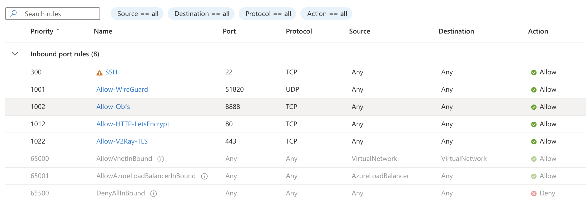

# SETUP

This repository contains setup files and documentation for deploying obfuscated network tunnels on home servers, tailored for restricted or filtered network environments.

## Technologies Used

In this repository, the following three technologies are mainly used:

- **WireGuard**: A high-performance and easy-to-setup VPN offering secure and fast connections with modern cryptography.
- **Shadowsocks + simple_obfs**: Shadowsocks is a high-speed proxy used to bypass network restrictions. The **simple_obfs** plugin is included to obfuscate the traffic, making it harder to detect by censorship systems.
- **V2Ray + TLS + WebSockets**: V2Ray is an advanced proxy platform supporting multiple transport methods. In this configuration, **V2Ray with TLS and WebSockets** is used to disguise the traffic as regular web requests (HTTPS), making it harder to block or detect.

## Prerequisites

To run the configurations and technologies provided in this repository, you'll first need a virtual machine which will act as a server. The **recommended virtual machine** setup is:

- **Provider**: Microsoft Azure
- **VM Type**: **Standard B1s** (recommended for cost/performance balance)
- **Region**: **Spain Central**
- **Zone**: **Zone 2**

However, you can use any other virtual machine or server that meets these basic requirements:

- Linux-based operating system (Ubuntu 20.04 or higher is recommended)
- Stable internet connection
- Administrator (root or sudo) access to the server

## Server Configuration

1. Connect to your VM.
2. Clone this repository in your VM
3. Execute the scripts according to what you want:

Before running a script, make sure it has execution permissions. Use the following commands:
```bash
    sudo chmod +x <script>
    sudo ./<script>
```

- If you only wish to install **WireGuard** in your server, execute the `wireguard.sh` script (notice that simple_obfs is also installed in this script). However if you want simple_obfs to work in your client device, you may need to do some additional configuration which is not detailed in this repository. This file wireguard.sh is for WireGuard setup. Once the script is successfully executed, find the WireGuard client app and install it on your client device (phone, laptop, ...). You can find the client app on the Play Store.

- If you want to add **shadowsocks + simple_obfs** to your server, execute the `shadowsocks.sh` script (if you already executed the wireguard.sh script previously, don't worry, there should not be any problems with that). Once the script is successfully executed, find the Shadowsocks client app on your client device and install it. You will also need to install the simple_obfs plugin on your client device. The plugin should be automatically recognized by the shadowsocks app. You can find the Sadowsocks client app on the Play Store or in the following repository: [Shadowsocks Android Releases](https://github.com/shadowsocks/shadowsocks-android/releases).  The simple_obfs plugin is also available here: [simple-obfs Releases](https://github.com/shadowsocks/simple-obfs/releases).

- If you need advanced network camouflage, use the third script: `v2ray.sh`, which will install **V2Ray + TLS + WebSockets**. For this script, you may need to modify the email address included in it and replace it with your own. You also need a valid domain address. You can get a free domain using online websites such as [Duck DNS](https://www.duckdns.org/). Once you log in and create an address, link your VM's ip address to the domain and use your domain on the script. NOTE: The certbot certificates should be automatically renewed once they expire. Port 80 is used by certbot-nginx. If you need to do any operations on this port, first stop the nginx proccesses. When the script is successfully executed, you can install the v2rayNG client. You can find the client on the following repository: [v2rayNG Releases](https://github.com/2dust/v2rayNG/releases).

## Ports Configuration

In this section, we will discuss the necessary port configurations for your setup. Make sure that the required ports are open in your server (VM) and that no other services are using these ports.

Here’s an overview of the required ports:

- **Port 51820**: Used by **WireGuard**.
- **Port 8888**: Used by **Shadowsocks + simple_obfs**.
- **Port 443**: Used for **V2Ray** with **TLS** and **WebSockets**.
- **Port 80**: Temporarily used by **Certbot** to obtain SSL certificates. Make sure to stop any conflicting services like **nginx** if needed.

Below is a diagram illustrating the port configuration:



## Client Configuration
Once the server is successfully configured, you can connect your own client devices (phone, laptop, ...) to the server and start configuring the tunnel. In order to do so, install the corresponding client apps in your device (you can find them on the **Server Configuration** section). And then add a configuration.

- **WireGuard Client**: The configuration should look similar to this. However you can enter it manually on the app. Remember to fill in with your server details (private key, public key, your server ip address, ...).

```ini
[Interface] 
PrivateKey = IPXCanj4HeBzSPyv2o+1HUJ6KU++yeFXk/bIncNvS2o= 
Address = 10.0.0.2/24 
DNS = 1.1.1.1 

[Peer] 
PublicKey = PyGR+wud1RWLr/qBOehhBsSMJD6By0ihGWlWdoTmo3A= 
Endpoint = <your_server_ip>:51820 
AllowedIPs = 0.0.0.0/0 
PersistentKeepalive = 25
```
- **Shadowsocks Client**: You can enter manually the information:
```ini
Server: <your_server_ip>
Remote Port: 8888
Password: tuseguro123
Encrypt Method: AES-256-GCM
Plugin: Enable the plugin simple obfuscation
Plugin Configuration: obfs=http
```
- **v2rayNG Client**: You can either type the information manually. To enter the information, add a new configuration and press "Type manually[VMESS]":
```ini
remarks: ChinaBypass
address: <your_domain>
port: 443
id: <the_id_generated_by_the_script>
security: auto
Network: ws
head type: --
ws host: <your_domain>
ws path: /myapp
TLS: tls
allowInsecure: false
```

Once the client is successfully configured, you can [check your IP address](https://whatismyipaddress.com/) to verify if it changes when you turn off and on the VPN tunnel on the client. This confirms the VPN tunnel is properly configured.
